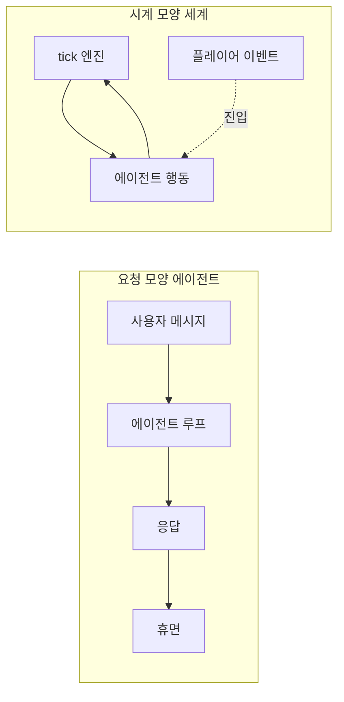
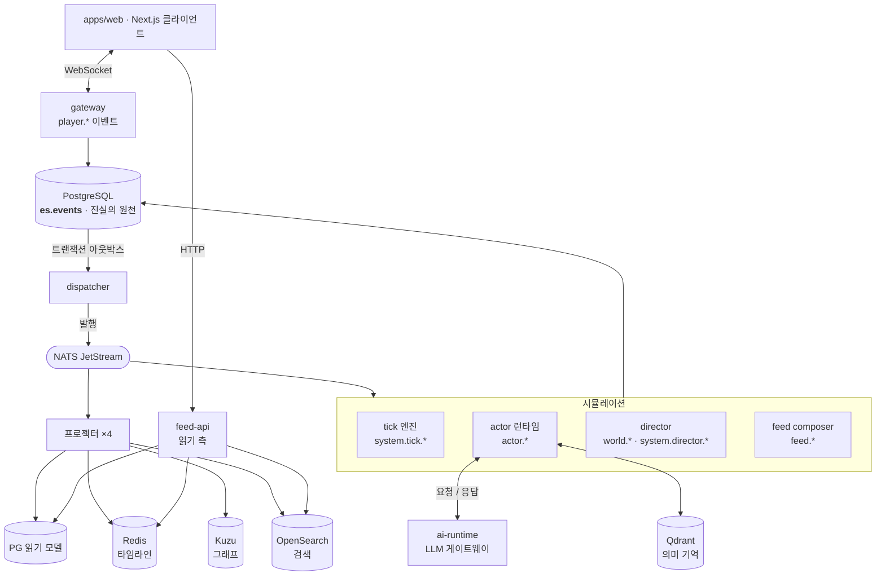
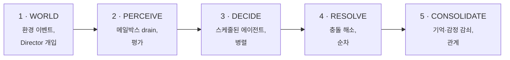
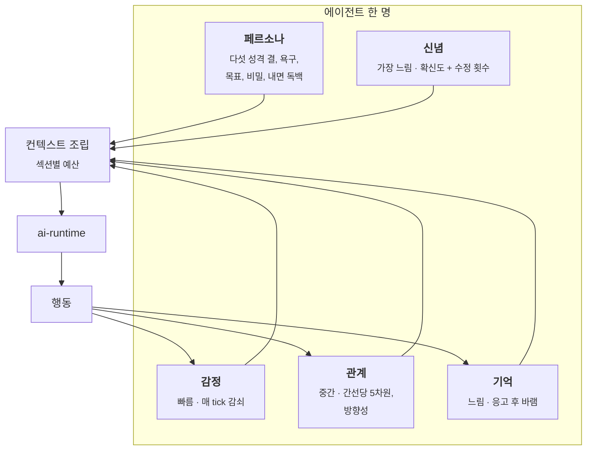

<h1 align="center">아키텍처</h1>

<p align="center">
  <b>아무도 보지 않는 동안에도 100명의 에이전트가 살아가는 방법.</b>
</p>

<p align="center">
  <a href="architecture.md">English</a> ·
  <b>한국어</b> ·
  <a href="architecture.zh.md">中文</a>
</p>

<p align="center">
  <sub><a href="workflow.ko.md">워크플로 →</a> &nbsp;·&nbsp; <a href="../README.md">← README</a></sub>
</p>

---

## 하나의 발상

대부분의 에이전트 시스템은 **요청 모양**입니다. 사용자가 메시지를 보내면 에이전트 루프가 돌고, 상태가 어딘가에 쓰이고, 다음 메시지까지는 아무것도 존재하지 않습니다. 에이전트에게는 자기 시간이 없습니다.

Living Feed는 **시계 모양**입니다. tick 엔진이 접속자가 있든 없든 세계 시간을 밀어냅니다. 매 tick마다 100명 중 일부가 지각하고 결정하고 행동합니다. 플레이어는 호출자가 아니라, 이미 돌아가고 있던 세계에 들어온 또 하나의 이벤트 원천입니다.

아래의 거의 모든 설계 결정이 이 하나의 뒤집기에서 따라 나옵니다.



---

## 시스템 지도



**그림 읽는 법:** 모든 흐름이 한 방향입니다. 엔진은 읽기 모델에 절대 쓰지 않고, 프로젝터는 절대 이벤트를 발행하지 않습니다. 결정이 화면에 닿는 유일한 경로는 *이벤트 적재 → 아웃박스 → NATS → 프로젝터 → 읽기 모델* 뿐입니다.

### 왜 아웃박스인가

엔진은 NATS에 직접 발행하지 않습니다. PostgreSQL에 적재하고, dispatcher가 아웃박스를 NATS로 중계합니다. 트랜잭션 아웃박스 패턴이고, 이것이 나머지 전부가 기대는 성질을 삽니다: **이벤트가 존재한다면 그것은 로그에 있다.** 발행됐지만 기록되지 않은 상태도, 기록됐지만 발행되지 않은 상태도 없습니다.

---

## 다섯 단계의 tick

1 tick = 실시간 60초 = 세계시간 4분. 세계는 4배속으로 흐릅니다.



단계들은 하나의 덩어리가 아니라 프로토콜입니다 — 각 엔진이 자기 몫만 구현합니다. 두 가지 성질이 하중을 받습니다.

- **DECIDE는 병렬, RESOLVE는 순차입니다.** 에이전트가 동시에 생각하는 이유는 그게 비싼 부분이기 때문이고, 행동이 결정적 순서로 착지하는 이유는 그게 재현되어야 하는 부분이기 때문입니다.
- **CONSOLIDATE가 기억의 비용을 치르는 자리입니다.** 감정이 감쇠하고, 관계가 갱신되고, 이번 tick의 경험이 하나의 에피소드로 접힙니다. 결정 안에서 무한히 쌓이는 것이 없습니다.

---

## 에이전트 한 명의 구성

여기서 에이전트는 도구가 달린 프롬프트가 아닙니다. 페르소나에 더해, 서로 다른 속도로 변하는 네 종류의 상태입니다.



### 기억의 네 계층

| 계층 | 어디에 | 수명 | 무엇 |
|---|---|---|---|
| **작업 기억** | Redis 리스트 | TTL 6시간, 50개 | 이번 tick의 지각과 행동 |
| **일화 기억** | `es.events` | 영구 | 이벤트 로그 그 자체 — 지워지지 않음 |
| **의미 기억** | Qdrant | 중요도에 따라 1~30일 | 응고된 에피소드, 임베딩되어 회상 가능 |
| **신념** | 이벤트 + Qdrant | 대체가 아니라 수정 | "내가 당신을 어떻게 생각하는가", 확신도 포함 |

수명주기는 **지각 → 응고 → 성찰 → 회상 → 감쇠** 입니다.

응고는 한 tick의 재료를 중요도 점수가 붙은 하나의 에피소드로 접습니다. 성찰은 에피소드들에 걸친 패턴을 신념으로 바꿉니다 — 언제나 도는 결정적 규칙 경로에, 사용할 수 없으면 조용히 생략되는 LLM 통찰이 선택적으로 더해집니다. 회상은 `actor_id`, 최소 중요도, 만료로 거릅니다.

**망각은 축출이 아니라 기능입니다.** 감쇠 시한을 넘긴 기억은 회상되지 않지만, 그것을 낳은 이벤트는 로그에 영원히 남습니다. "잊었다"와 "없었다"는 다른 상태이고, 에이전트가 왜 그렇게 행동했는지 디버깅할 때 이 구분이 결정적입니다.

### 컨텍스트는 쌓이지 않고 배분됩니다

| 섹션 | 예산 |
|---|---|
| 정체성 | 800 토큰 |
| 작업 기억 | 1,200 |
| 에피소드 | 600 |
| 과업 프레임 | 600 |
| 세계 | 400 |
| 본 포스트 | 400 |
| 관계 | 300 |

세계시간으로 한 달을 산 에이전트가 어제 태어난 에이전트와 같은 크기의 프롬프트를 보냅니다. 비용 통제이자 **품질 통제**입니다 — 컨텍스트가 무한정 늘어나는 것이 에이전트가 흐리멍덩해지는 경로니까요.

---

## 권한은 요청이 아니라 집행됩니다

모든 이벤트 타입에는 발행할 수 있는 주체가 정확히 하나씩 있고, dispatcher가 중계 시점에 검증합니다.

| 주체 | 발행 가능 |
|---|---|
| `engine.tick` | `system.tick.*` |
| `engine.actor` | `actor.*` |
| `engine.director` | `world.*`, `system.director.*` |
| `engine.feed` | `feed.*` |
| `engine.relationship` | `relationship.*` |
| `services.gateway` | `player.*`, 그리고 은퇴/복원 두 타입만 |
| `services.ai-runtime` | *없음* |
| `services.projector` | *없음* |

두 항목이 설계를 떠받칩니다.

**Director는 `actor.*`나 `relationship.*`을 쓸 수 없습니다.** 세계 사건을 무대에 올리고, 누군가를 스포트라이트하고, 인생 아크를 계획할 수는 있습니다 — 하지만 인물 안으로 손을 뻗어 감정을 설정하거나 관계를 움직일 수는 없습니다. 서사적 압력은 에이전트 자신의 지각을 통과하거나, 아니면 아예 닿지 않습니다. 연출가와 인형술사의 차이이고, 관례가 아니라 **스키마 계층에서 집행**됩니다.

**AI 런타임은 아무것도 발행하지 않습니다.** LLM은 결정 안의 함수 호출이지 역사의 저자가 아닙니다. 모델이 만든 모든 것은 그것을 요청한 에이전트가 발행한 이벤트로서 세계에 들어옵니다.

---

## 데이터가 사는 곳

| 저장소 | 역할 | 재구축 가능? |
|---|---|---|
| **PostgreSQL** `es.events` | 진실의 원천 — 추가 전용 로그 | **불가.** 이것이 세계입니다. |
| PostgreSQL 읽기 모델 | 질의 모양 프로젝션 | 가능 |
| **NATS JetStream** | 서비스 간 이벤트 버스 | 가능 (보존 한도 있음) |
| **Redis** | 피드 타임라인, 세션, 프레즌스, 메일박스 | 가능 |
| **Kuzu** | 관계 그래프 프로젝션 | 가능 |
| **Qdrant** | 의미 기억 색인 | 가능 |
| **OpenSearch** | 포스트·이야기 검색 | 가능 |

일곱 중 여섯이 소모품입니다. 무엇을 지우든 로그로부터 재구축됩니다 — [워크플로 → 디버깅](workflow.ko.md#디버깅-검사-재구축-리플레이) 참고.

---

## 비용은 스케줄링 문제입니다

tick당 LLM 호출 수는 옆에 덧붙인 rate limit이 아닙니다. **스케줄러 그 자체**입니다.

모든 에이전트는 얼마나 자주 생각할지를 정하는 LOD 티어를 가집니다.

| 티어 | 결정 주기 | 강등 |
|---|---|---|
| **Hot** | 매 tick | 10 tick 유휴 → Warm |
| **Warm** | 10 tick마다 | 50 tick 유휴 → Cold |
| **Cold** | 100 tick마다 | — |

Warm·Cold는 id 해시로 주기에 걸쳐 분산되어 같은 tick에 몰리지 않습니다. 강등에는 히스테리시스가 있어 티어가 튀지 않습니다.

Hot 승격은 **정확히 셋만** 트리거합니다: 응답 의무가 있는 플레이어 상호작용, Director의 지목, 임계 이상 강도의 세계 사건. 나머지 전부 — 다른 에이전트가 내 포스트에 단 댓글을 포함해 — 는 승격 없이 강등 타이머만 리셋합니다.

마지막 제외는 실수가 아닙니다. **흉터**입니다. [워크플로 → 비용 사고](workflow.ko.md#비용-사고) 참고.

### 조절 손잡이

| 변수 | 기본값 | 효과 |
|---|---|---|
| `LF_WORLD_MODE` | `idle` | `idle`: 전부 Cold로 강등, 개입할 때만 LLM. `lively`: 상시 Hot 바닥을 고정해 ambient 활동 |
| `LF_MAX_ACTORS` | 15 | 세계 인구, 10~1000 클램프 |
| `LF_HOT_START_ACTORS` | 6 | 콜드 스타트 상한 — 몇 명이 Hot으로 부팅할지 |
| `LF_AI_CONCURRENCY` | 4 | 동시 LLM 호출 (세마포어) |
| `LF_AI_PROVIDER` | `local` | `rule`은 LLM 없이 세계 전체를 돌립니다 |
| `LF_MODEL_ROUTES` | — | `(task, tier)`별 모델 라우팅 |

호스티드 API로 돌릴 계획이라면 `LF_MODEL_ROUTES`가 핵심입니다: `decide_action/hot`은 좋은 모델로, Warm 이하는 싼 모델로 보내면 플레이어가 실제로 보는 상호작용에만 돈을 씁니다.

> **알려진 공백.** 누적 지출 상한이 없습니다. 위의 모든 통제는 빈도·동시성·티어 모양이고, 어느 것도 회계 장부가 아닙니다. 로컬에서는 GPU가 자연적 상한이지만, 호스티드 API를 쓴다면 벤더 쪽 지출 한도를 거세요. 토큰 예산 하드 캡과 서킷브레이커는 계획돼 있고, 아직 구현되지 않았습니다.

---

## 언어 간 계약

시뮬레이션은 Python, 클라이언트는 TypeScript입니다. 이벤트 스키마는 JSON Schema로 한 번 선언되어 양쪽으로 코드 생성되고, CI가 두 관문을 강제합니다.

1. **드리프트** — 재생성해서 커밋된 산출물과 다르면 실패.
2. **하위 호환성** — 보관된 샘플 이벤트를 새 스키마로 재검증. 이미 로그에 쓰인 이벤트는 **영원히** 파싱되어야 합니다.

두 번째 관문이 로그를 진실의 원천으로 신뢰할 수 있게 만듭니다. 역사를 깨는 스키마 변경은 마이그레이션이 아니라 **빌드 실패**입니다.

---

## 저장소 구조

```
apps/web          Next.js 클라이언트 — 피드, 그래프, 스튜디오, 받은 것
services/         gateway · feed-api · dispatcher · ai-runtime · projector
engine/           actor · director · tick · emotion · relationship · goal · feed
packages/         schemas · eventstore · api-client · ui
agents/           페르소나, 프롬프트, 도구, 커뮤니티
infra/            compose 스택, 기동 스크립트
```

아키텍처 결정은 비공개 작업 저장소에 ADR로 기록됩니다. 이 문서가 공개 요약본입니다.

---

<p align="center">
  <a href="workflow.ko.md"><b>다음: 워크플로 →</b></a><br>
  <sub>tick 안에서 실제로 벌어지는 일, 댓글을 달았을 때의 경로, 그리고 디버깅.</sub>
</p>
