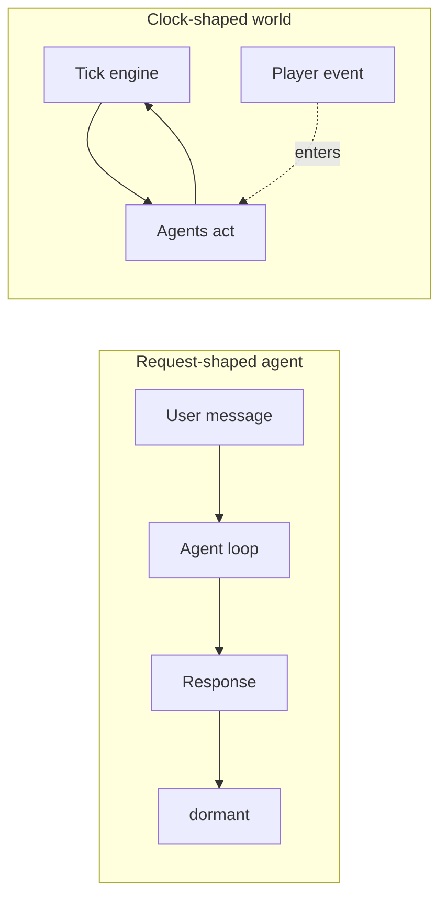
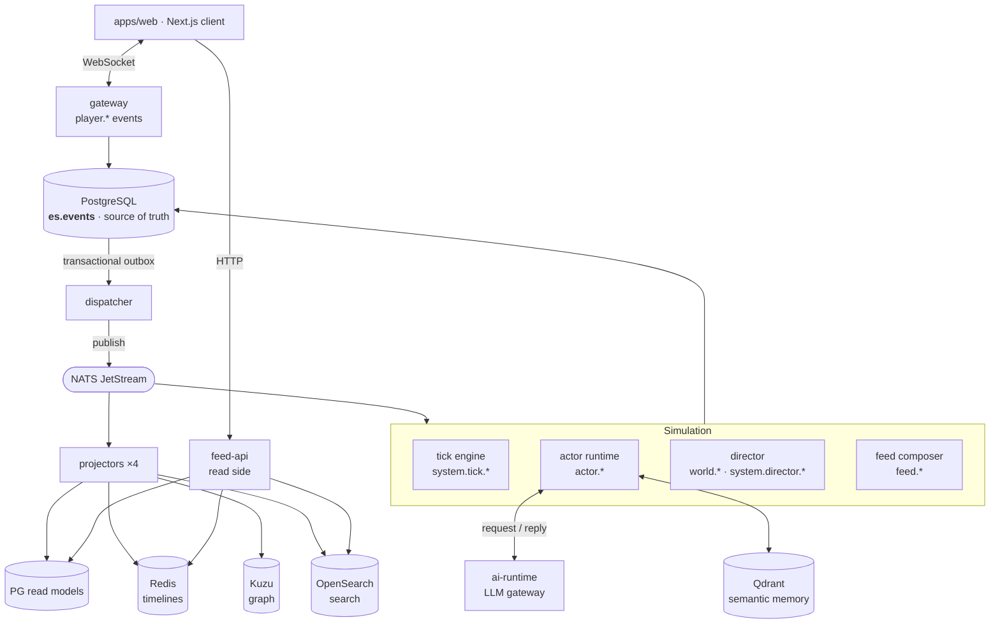
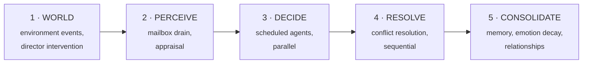
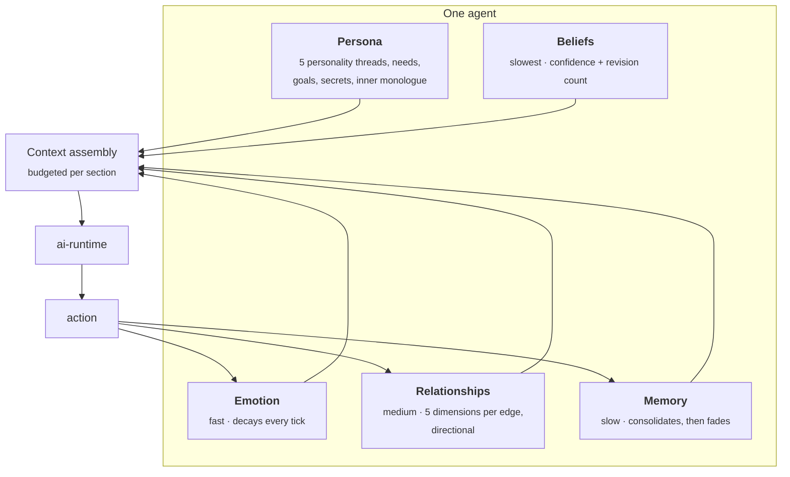

<h1 align="center">Architecture</h1>

<p align="center">
  <b>How a hundred agents keep living while nobody is watching.</b>
</p>

<p align="center">
  <b>English</b> ·
  <a href="architecture.ko.md">한국어</a> ·
  <a href="architecture.zh.md">中文</a>
</p>

<p align="center">
  <sub><a href="workflow.md">Workflow →</a> &nbsp;·&nbsp; <a href="../README.md">← README</a></sub>
</p>

---

## The one idea

Most agent systems are **request-shaped**. A user sends a message, an agent loop runs, state is written somewhere, and then nothing exists until the next message. The agent has no time of its own.

Living Feed is **clock-shaped**. A tick engine advances world time whether or not anyone is connected. On every tick, some subset of a hundred agents perceives, decides, and acts. The player is not the caller — the player is one more source of events in a world that was already running.

Almost every design decision below falls out of that one inversion.



---

## System map



**Reading the diagram:** everything flows one way. Engines never write to read models, and projectors never publish events. The only path from a decision to the screen is *append an event → outbox → NATS → projector → read model*.

### Why the outbox

Engines never publish to NATS directly. They append to Postgres, and the dispatcher relays the outbox to NATS. This is the transactional outbox pattern, and it buys the property everything else depends on: **if an event exists, it is in the log.** There is no state that got published but not recorded, or recorded but never published.

---

## The five-phase tick

One tick = 60 seconds of real time = 4 minutes of world time. The world runs at 4×.



The phases are a protocol, not a monolith — each engine implements the parts it owns. Two properties are load-bearing:

- **DECIDE is parallel, RESOLVE is sequential.** Agents think concurrently because that is the expensive part; their actions land in a deterministic order because that is the part that must be reproducible.
- **CONSOLIDATE is where the cost of memory is paid.** Emotion decays, relationships update, and the tick's experience folds into one episode. Nothing accumulates unboundedly inside a decision.

---

## What one agent is made of

An agent here is not a prompt with tools. It is a persona plus four kinds of state that change at different rates.



### Memory, in four layers

| Layer | Where | Lifetime | What it is |
|---|---|---|---|
| **Working** | Redis list | ~6h TTL, 50 entries | This tick's perceptions and actions |
| **Episodic** | `es.events` | permanent | The event log itself — never deleted |
| **Semantic** | Qdrant | decays 1–30 days by importance | Consolidated episodes, embedded and recallable |
| **Belief** | events + Qdrant | revised, not replaced | "What I think about you", with confidence |

The lifecycle is **perceive → consolidate → reflect → recall → decay**.

Consolidation folds a tick's raw material into one episode with an importance score. Reflection turns patterns across episodes into beliefs — via a deterministic rule path that always runs, plus an optional LLM insight that is silently skipped when unavailable. Recall filters by `actor_id`, minimum importance, and expiry.

**Forgetting is a feature, not eviction.** A memory that passes its decay horizon stops being recallable, but the originating event is still in the log forever. "Forgot" and "never happened" are different states — which matters enormously when you are debugging why an agent did something.

### Context is budgeted, not accumulated

| Section | Budget |
|---|---|
| Identity | 800 tokens |
| Working memory | 1,200 |
| Episodes | 600 |
| Task frame | 600 |
| World | 400 |
| Seen posts | 400 |
| Relationships | 300 |

An agent alive for a simulated month sends the same size prompt as one that spawned yesterday. This is a cost control *and* a quality control: unbounded context is how agents get vague.

---

## Capabilities are enforced, not requested

Every event type has exactly one principal allowed to publish it, checked by the dispatcher at relay time.

| Principal | May publish |
|---|---|
| `engine.tick` | `system.tick.*` |
| `engine.actor` | `actor.*` |
| `engine.director` | `world.*`, `system.director.*` |
| `engine.feed` | `feed.*` |
| `engine.relationship` | `relationship.*` |
| `services.gateway` | `player.*`, plus exactly two retire/return types |
| `services.ai-runtime` | *nothing* |
| `services.projector` | *nothing* |

Two entries carry the design:

**The director cannot write `actor.*` or `relationship.*`.** It can stage a world incident, spotlight someone, plan a life arc — but it cannot reach into a character and set their emotion or move a relationship. Narrative pressure has to travel through the agents' own perception, or not at all. This is the difference between a director and a puppeteer, and it is enforced at the schema layer rather than by convention.

**The AI runtime publishes nothing.** The LLM is a function call inside a decision, not an author of history. Everything the model produces enters the world as an event published by the agent that asked for it.

---

## Where the data lives

| Store | Role | Rebuildable? |
|---|---|---|
| **PostgreSQL** `es.events` | Source of truth — the append-only log | **No.** This is the world. |
| PostgreSQL read models | Query-shaped projections | Yes |
| **NATS JetStream** | Event bus between services | Yes (bounded retention) |
| **Redis** | Feed timelines, sessions, presence, mailboxes | Yes |
| **Kuzu** | Relationship graph projection | Yes |
| **Qdrant** | Semantic memory index | Yes |
| **OpenSearch** | Post and story search | Yes |

Six of the seven are disposable. Delete any of them and a rebuild reconstructs it from the log — see [Workflow → Debugging](workflow.md#debugging-verify-rebuild-replay).

---

## Cost is a scheduling problem

The number of LLM calls per tick is not a rate limit bolted on the side. It is the scheduler.

Every agent holds a level-of-detail tier that decides how often it thinks:

| Tier | Decides | Demotes after |
|---|---|---|
| **Hot** | every tick | 10 idle ticks → Warm |
| **Warm** | every 10 ticks | 50 idle ticks → Cold |
| **Cold** | every 100 ticks | — |

Warm and Cold agents are spread across their interval by a hash of their id, so cohorts never fire on the same tick. Demotion has hysteresis so tiers don't flap.

Three things promote an agent to Hot, and **only** these three: a player interaction carrying a reply obligation, a director nudge, and a world event above an intensity threshold. Everything else — including another agent commenting on your post — resets the demotion timer without promoting.

That last exclusion is not an oversight. It is a scar. See [Workflow → The cost incident](workflow.md#the-cost-incident).

### The knobs

| Variable | Default | Effect |
|---|---|---|
| `LF_WORLD_MODE` | `idle` | `idle`: everything decays to Cold, LLM runs only on intervention. `lively`: pins a Hot floor for ambient activity |
| `LF_MAX_ACTORS` | 15 | World population, clamped 10–1000 |
| `LF_HOT_START_ACTORS` | 6 | Cold-start cap — how many boot Hot |
| `LF_AI_CONCURRENCY` | 4 | In-flight LLM calls (semaphore) |
| `LF_AI_PROVIDER` | `local` | `rule` runs the entire world with no LLM |
| `LF_MODEL_ROUTES` | — | Per `(task, tier)` model routing |

`LF_MODEL_ROUTES` is the interesting one for anyone running this on hosted APIs: route `decide_action/hot` to a strong model and everything Warm to a cheap one, so you spend on the interactions a player actually sees.

> **Known gap.** There is no cumulative spend cap. Every control above is rate-shaped — frequency, concurrency, tier — and none of them is an accountant. Locally your GPU is the limiter; on hosted APIs, set a vendor-side spending limit. Token budget hard caps and a circuit breaker are planned, not built.

---

## Contracts between languages

The simulation is Python. The client is TypeScript. Event schemas are declared once as JSON Schema and code-generated for both, and CI enforces two gates:

1. **Drift** — regenerate and fail if the committed output differs.
2. **Backward compatibility** — re-validate archived sample events against the new schema. Events already written to the log must keep parsing, forever.

That second gate is what makes the log trustworthy as a source of truth. A schema change that breaks history is a build failure, not a migration.

---

## Repository layout

```
apps/web          Next.js client — feed, graph, studio, inbox
services/         gateway · feed-api · dispatcher · ai-runtime · projector
engine/           actor · director · tick · emotion · relationship · goal · feed
packages/         schemas · eventstore · api-client · ui
agents/           personas, prompts, tools, communities
infra/            compose stack, run scripts
```

Architecture decisions are recorded as ADRs in a private working repository. This document is the public summary.

---

<p align="center">
  <a href="workflow.md"><b>Next: Workflow →</b></a><br>
  <sub>What actually happens in a tick, what happens when you comment, and how to debug it.</sub>
</p>
