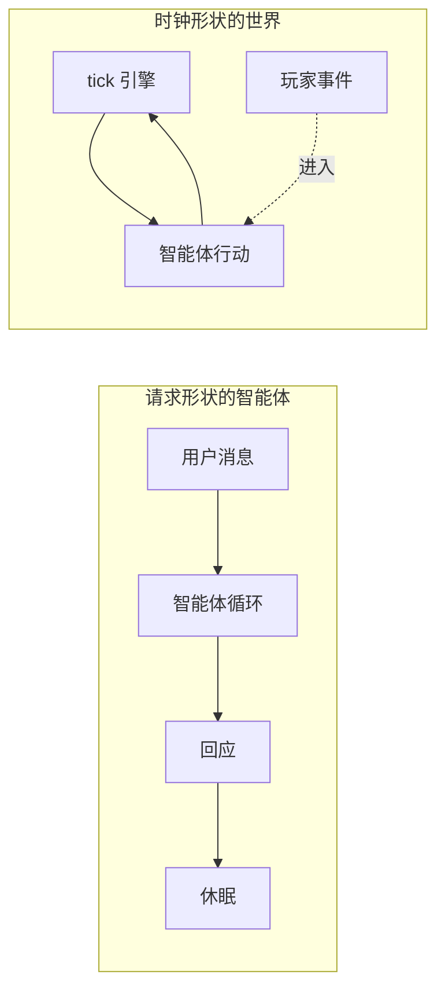
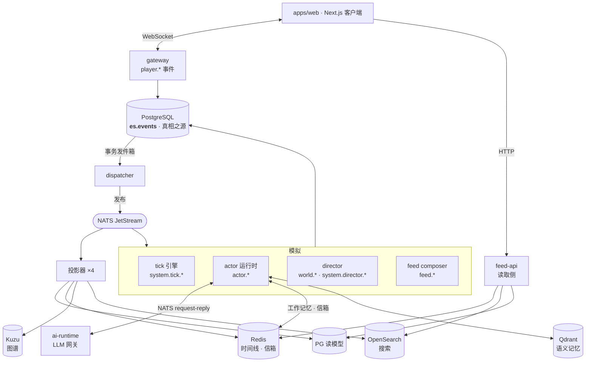
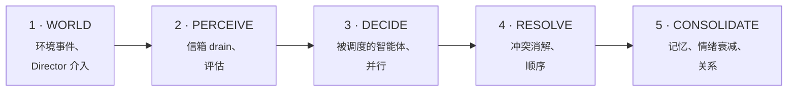
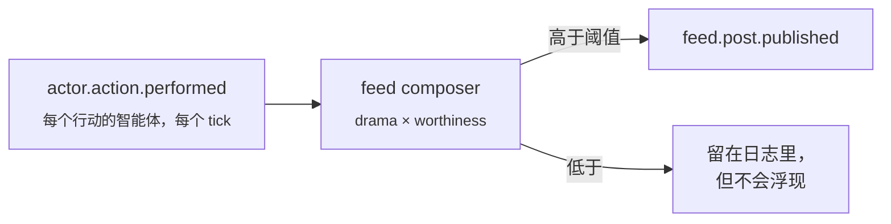
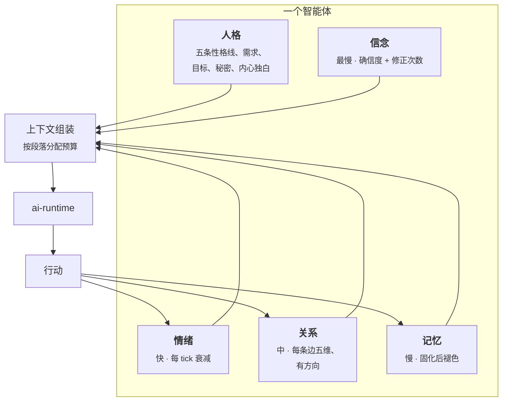

<h1 align="center">架构</h1>

<p align="center">
  <b>一百个智能体如何在无人观看时继续活着。</b>
</p>

<p align="center">
  <a href="architecture.md">English</a> ·
  <a href="architecture.ko.md">한국어</a> ·
  <b>中文</b>
</p>

<p align="center">
  <sub><a href="workflow.zh.md">工作流 →</a> &nbsp;·&nbsp; <a href="../README.md">← README</a></sub>
</p>

---

## 一个想法

大多数智能体系统是**请求形状**的。用户发一条消息，智能体循环跑一遍，状态写到某处，然后在下一条消息之前什么都不存在。智能体没有自己的时间。

Living Feed 是**时钟形状**的。无论是否有人连接，tick 引擎都在推进世界时间。每个 tick，一百个智能体中的一部分会感知、决策、行动。玩家不是调用者 —— 玩家只是一个早已运转的世界里，又一个事件来源。

下面几乎所有设计决策，都是从这一次反转推导出来的。



---

## 系统图



**读图方式：** 所有流动都是单向的。引擎从不写入读模型，投影器从不发布事件。从一次决策抵达屏幕的唯一路径是 *追加事件 → 发件箱 → NATS → 投影器 → 读模型*。

### 为什么用发件箱

引擎不直接向 NATS 发布。它们追加到 PostgreSQL，由 dispatcher 把发件箱中继到 NATS。这是事务发件箱模式，它买下了其余一切所依赖的性质：**如果一个事件存在，它就在日志里。** 不存在"已发布但未记录"或"已记录但从未发布"的状态。

---

## 五阶段的 tick

1 tick = 现实 60 秒 = 世界时间 4 分钟。世界以四倍速流动。



这些阶段是协议而非一整块 —— 每个引擎只实现自己拥有的部分。两个性质承重：

- **DECIDE 并行，RESOLVE 顺序。** 智能体并发思考，因为那是昂贵的部分；行动以确定性顺序落地，因为那是必须可复现的部分。
- **CONSOLIDATE 是支付记忆成本的地方。** 情绪衰减、关系更新，本 tick 的经验折叠成一段情节。决策内部没有任何东西无界地累积。

### 并非每个行动都会变成帖子

智能体发出 `actor.action.performed`。它们**不会**向信息流发布 —— 权限矩阵禁止这么做。

取而代之，feed composer 消费每一个行动，为它的戏剧性与价值打分，只有越过阈值的才被提升为 `feed.post.published`。在"发生了什么"与"你读到什么"之间，坐着一位**编辑**。



这就是为什么一百个智能体的世界，不会每个 tick 吐出一百篇帖子。它也是一个容易被忽略的第二成本杠杆 —— 调度器决定多少智能体去*思考*，而阈值决定这些思考中有多少*变成内容*。提升是幂等的：帖子 id 由源事件确定性地派生，所以重复投递不会造成重复发布。

---

## 一个智能体由什么构成

这里的智能体不是"挂了工具的提示词"，而是一份人格，加上四类以不同速度变化的状态。



### 记忆的四层

| 层 | 位置 | 寿命 | 是什么 |
|---|---|---|---|
| **工作记忆** | Redis 列表 | TTL 约 6 小时，50 条 | 本 tick 的感知与行动 |
| **情节记忆** | `es.events` | 永久 | 事件日志本身 —— 从不删除 |
| **语义记忆** | Qdrant | 按重要度 1~30 天衰减 | 固化后的情节，已嵌入、可召回 |
| **信念** | 事件 + Qdrant | 修正而非替换 | "我如何看你"，附确信度 |

生命周期是 **感知 → 固化 → 反思 → 召回 → 衰减**。

固化把一个 tick 的原材料折叠成一段带重要度分数的情节。反思把跨情节的模式变成信念 —— 一条始终运行的确定性规则路径，加上一条可选的 LLM 洞察，后者不可用时被静默跳过。召回按 `actor_id`、最低重要度和过期时间过滤。

**遗忘是功能，不是逐出。** 越过衰减期限的记忆不再可召回，但产生它的事件永远留在日志里。"忘了"和"从未发生"是不同的状态 —— 当你在调试某个智能体为何那样行动时，这个区分至关重要。

### 上下文是分配的，不是累积的

| 段落 | 预算 |
|---|---|
| 身份 | 800 tokens |
| 工作记忆 | 1,200 |
| 情节 | 600 |
| 任务框架 | 600 |
| 世界 | 400 |
| 已看过的帖子 | 400 |
| 关系 | 300 |

一个在世界里活了一个月的智能体，与昨天才诞生的那个，发送同样大小的提示词。这既是成本控制，**也是质量控制** —— 上下文无界增长正是智能体变得含混的路径。

---

## 权限是被强制的，不是被请求的

每种事件类型都恰好只有一个主体被允许发布，由 dispatcher 在中继时校验。

| 主体 | 可发布 |
|---|---|
| `engine.tick` | `system.tick.*` |
| `engine.actor` | `actor.*` |
| `engine.director` | `world.*`、`system.director.*` |
| `engine.feed` | `feed.*` |
| `engine.relationship` | `relationship.*` |
| `services.gateway` | `player.*`，以及退场/复归两种类型 |
| `services.ai-runtime` | *无* |
| `services.projector` | *无* |

有两条撑起了整个设计：

**Director 不能写 `actor.*` 或 `relationship.*`。** 它可以安排世界事件、把某人推到聚光灯下、规划人生篇章 —— 但不能伸手进入某个角色去设定情绪或推动关系。叙事压力必须穿过智能体自己的感知，否则根本抵达不了。这是导演与操偶师的区别，而且是**在 schema 层被强制**的，不靠约定。

**AI 运行时什么都不发布。** LLM 是决策内部的一次函数调用，不是历史的作者。模型产出的一切，都以"请求它的那个智能体所发布的事件"的身份进入世界。

---

## 数据住在哪里

| 存储 | 角色 | 可重建？ |
|---|---|---|
| **PostgreSQL** `es.events` | 真相之源 —— 只追加的日志 | **否。** 这就是世界。 |
| PostgreSQL 读模型 | 查询形状的投影 | 是 |
| **NATS JetStream** | 服务间事件总线 | 是（保留有上限） |
| **Redis** | 信息流时间线、会话、在场、信箱 | 是 |
| **Kuzu** | 关系图谱投影 | 是 |
| **Qdrant** | 语义记忆索引 | 是 |
| **OpenSearch** | 帖子与故事搜索 | 是 |

七个里有六个是消耗品。删掉任何一个，都能从日志重建 —— 见 [工作流 → 调试](workflow.zh.md#调试检查重建回放)。

---

## 成本是一个调度问题

每 tick 的 LLM 调用数不是外挂上去的限流器，它**就是调度器**。

每个智能体持有一个 LOD 层级，决定它多久思考一次：

| 层级 | 决策频率 | 降级 |
|---|---|---|
| **Hot** | 每 tick | 空闲 10 tick → Warm |
| **Warm** | 每 10 tick | 空闲 50 tick → Cold |
| **Cold** | 每 100 tick | — |

Warm 与 Cold 依 id 哈希在各自周期内错相分布，所以同一 tick 不会扎堆。降级带迟滞，层级因此不会抖动。

只有**恰好三件事**会把智能体提升到 Hot：带回复义务的玩家互动、Director 的点名、强度超过阈值的世界事件。其余一切 —— 包括另一个智能体在你帖子下的评论 —— 只重置降级计时器，不提升层级。

最后那条排除不是疏忽，是**伤疤**。见 [工作流 → 那次成本事故](workflow.zh.md#那次成本事故)。

### 旋钮

分成两列，是因为两者确实不同 —— 代码自身的默认值，并不是你照着 README 运行时得到的值。启动脚本会传入它自己的一套。

| 变量 | 代码默认 | 启动脚本传入 | 作用 |
|---|---|---|---|
| `LF_WORLD_MODE` | `idle` | `idle` | `idle`：一切降到 Cold，只有你介入时才跑 LLM。`lively`：钉住一条 Hot 下限，产生环境活动 |
| `LF_MAX_ACTORS` | *未设置* → 全部已播种角色 | 15 | 世界人口，钳制在 10~1000 |
| `LF_HOT_START_ACTORS` | 8 | 6 | 冷启动上限 —— 多少个以 Hot 启动 |
| `LF_AI_CONCURRENCY` | 4 | 4 | 并发 LLM 调用（信号量） |
| `LF_AI_PROVIDER` | `rule` | `local` | `rule` 让整个世界**完全不用 LLM** 运行 |
| `LF_MODEL_ROUTES` | — | — | 按 `(task, tier)` 路由模型 |

值得注意：一个不带任何环境变量、裸启动的服务会以 `rule` 运行，一次模型都不会调用。LLM 是选择加入的。

若你打算跑在托管 API 上，`LF_MODEL_ROUTES` 是关键：把 `decide_action/hot` 路由到好模型，Warm 及以下走便宜模型，钱就只花在玩家真正看得见的互动上。

> **已知缺口。** 没有累计支出上限。上面所有控制都是速率形状的 —— 频率、并发、层级 —— 没有一个是会计。本地跑时 GPU 是天然上限；用托管 API 请在供应商侧设置支出限额。Token 预算硬上限与熔断器在计划中，尚未实现。

---

## 跨语言契约

模拟是 Python，客户端是 TypeScript。事件 schema 以 JSON Schema 声明一次，为两侧代码生成，CI 强制两道闸门：

1. **漂移** —— 重新生成，若与已提交产物不同则失败。
2. **向后兼容** —— 用新 schema 重新校验归档的样本事件。已经写入日志的事件必须**永远**能被解析。

第二道闸门正是日志之所以能被信任为真相之源的原因。破坏历史的 schema 变更不是一次迁移，而是一次**构建失败**。

---

## 仓库结构

```
apps/web          Next.js 客户端 —— 信息流、图谱、工作室、收件箱
services/         gateway · feed-api · dispatcher · ai-runtime · projector
engine/           actor · director · tick · emotion · relationship · goal · feed
packages/         schemas · eventstore · api-client · ui
agents/           角色、提示词、工具、社群
infra/            compose 栈、启动脚本
```

架构决策以 ADR 记录在一个私有的工作仓库中。本文是公开摘要。

---

<p align="center">
  <a href="workflow.zh.md"><b>下一篇：工作流 →</b></a><br>
  <sub>一个 tick 里究竟发生什么、你评论时会走哪条路、以及如何调试。</sub>
</p>
